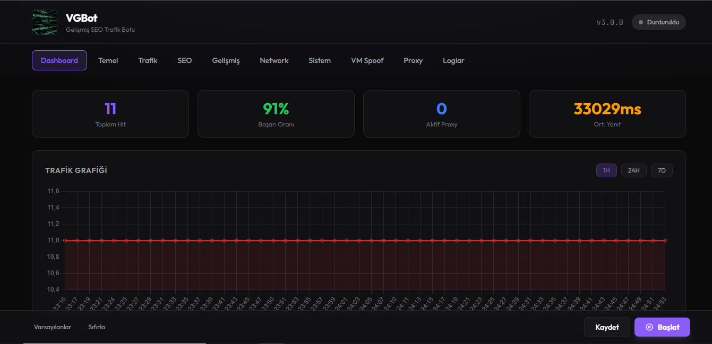

<div align="center">



<br><br>

# ⚡ VGBot

### Next-Generation SEO Traffic Engine

<br>

[](https://golang.org)
[](LICENSE)
[](https://github.com/muqo16/vg-hitbot/releases)
[](https://github.com/muqo16/vg-hitbot/stargazers)
[](http://localhost:8754)

<br>

**🇬🇧 [English](#-overview)** &nbsp;&nbsp;|&nbsp;&nbsp; **🇹🇷 [Türkçe](#-genel-bakış)**

<br>

<table>
<tr>
<td align="center">🎯<br><b>Parasitic SEO</b></td>
<td align="center">🔒<br><b>Anti-Detection</b></td>
<td align="center">📊<br><b>Real-time Analytics</b></td>
<td align="center">🌐<br><b>50+ Browsers</b></td>
<td align="center">📱<br><b>Telegram Alerts</b></td>
<td align="center">🏗️<br><b>Distributed</b></td>
</tr>
</table>

</div>

<br>

---

<br>

> **VGBot** turns your SEO strategy into autopilot. Generate thousands of realistic, keyword-driven organic visits with browser fingerprinting, GA4 analytics injection, and intelligent proxy rotation — all from a single binary.

<br>

# 🇬🇧 Overview

VGBot is a **production-grade SEO traffic simulation engine** built in Go. It doesn't just send requests — it launches real headless Chrome browsers, types keywords into search engines, clicks your links, scrolls your pages, fires GA4 events, and behaves like a real human visitor. Every. Single. Time.

```
  Keywords          Search Engine         Your Website          Analytics
  ┌──────┐         ┌───────────┐         ┌───────────┐        ┌──────────┐
  │ SEO  │────────►│  Google   │────────►│  Visit +  │───────►│  GA4     │
  │ Terms│         │  Bing     │         │  Scroll + │        │  Events  │
  │      │         │  Yahoo    │         │  Click    │        │  ✓ Done  │
  └──────┘         └───────────┘         └───────────┘        └──────────┘
       30x faster with Browser Pool 🚀        Unique fingerprint per visit 🔒
```

<br>

## 🔥 Why VGBot?

<table>
<tr>
<td width="50%">

### ⚡ Blazing Fast
- **Browser Pool** — Pre-allocated Chrome instances
- **~30x faster** visit initiation vs traditional
- **50 concurrent browsers** at once
- **1,700+ hits/min** in distributed mode

</td>
<td width="50%">

### 🛡️ Undetectable
- **Canvas/WebGL/Audio** fingerprint noise
- **JA3/JA4** TLS randomization
- **30+ device profiles** with real brands
- **VM detection bypass** (VMware, VBox, Hyper-V)

</td>
</tr>
<tr>
<td width="50%">

### 📊 Full Analytics
- **GA4/GTM** event injection (page_view, scroll, click)
- **Prometheus** metrics + **Grafana** dashboards
- **WebSocket** real-time streaming
- **CSV/JSON/HTML** report export

</td>
<td width="50%">

### 🧠 Smart Behavior
- **7 visitor profiles** (reader, shopper, bouncer...)
- **Session depth** control (2-5 pages)
- **Returning visitors** with persistent cookies
- **Bounce rate** targeting

</td>
</tr>
</table>

<br>

## ✨ Feature Highlights

### 🎯 Core Engine
| | Feature | What It Does |
|---|---------|-------------|
| 🔍 | **Keyword Targeting** | Simulates visits from Google/Bing search results for your keywords |
| 🌐 | **Multi-Browser** | Up to 50 concurrent headless Chrome instances |
| 🏎️ | **Browser Pool** | Pre-allocated instances — ~30x faster than cold starts |
| 📈 | **GSC Integration** | Import real queries from Google Search Console |
| 🗺️ | **Sitemap Crawling** | Auto-discover pages from sitemap.xml |
| 🖥️ | **Dual Mode** | Modern web dashboard + powerful CLI mode |

### 🔒 Stealth & Anti-Detection
| | Feature | What It Does |
|---|---------|-------------|
| 🎨 | **Canvas Fingerprint** | Unique canvas/WebGL/Audio noise per visit |
| 🔐 | **TLS Fingerprint** | JA3/JA4 randomization across Chrome/Firefox/Safari/Edge |
| 📱 | **Device Emulation** | 30+ real device profiles (iPhone, Samsung, Pixel...) |
| 🌍 | **Geo Spoofing** | Country, timezone, language per visit |
| 🖥️ | **VM Spoofing** | Hides VirtualBox/VMware/Hyper-V traces |
| 👻 | **Headless Bypass** | Passes bot detection scripts |

### 🔄 Network & Proxy
| | Feature | What It Does |
|---|---------|-------------|
| 🔄 | **7 Rotation Strategies** | weighted, round-robin, random, fastest, geo, least-used, success-rate |
| 🌐 | **Public Proxy Pool** | Auto-fetch & test from public lists |
| 🔌 | **Multi-Proxy** | Add unlimited private proxies |
| ⚡ | **HTTP/3 QUIC** | Next-gen protocol support |
| 🔗 | **Connection Pool** | ~40% less connection overhead |
| 🛑 | **Circuit Breaker** | Auto-recovery from failures |

### 📱 Telegram Notifications — *New in v3.0.0*
| | Feature | What It Does |
|---|---------|-------------|
| 🔔 | **Start/Stop Alerts** | Instant notification when simulation begins or ends |
| 📊 | **Periodic Reports** | Auto-send performance stats every X minutes |
| ✅ | **Connection Test** | Verify bot setup directly from dashboard |
| ⚙️ | **Easy Setup** | Configure everything from the Telegram tab |

### 🏗️ Enterprise Features
| | Feature | What It Does |
|---|---------|-------------|
| 🌐 | **Distributed Mode** | Master-Worker architecture across machines |
| 🔄 | **Hot-Reload** | Config changes apply without restart |
| 📝 | **Structured Logging** | Zap JSON logs with rotation |
| ⚙️ | **CPU Affinity** | Pin to specific cores for performance |
| 🧠 | **NUMA Aware** | Memory optimization for multi-socket servers |
| 🌍 | **i18n** | Full Turkish + English support |

<br>

## 📦 Installation

### Download Binary (Recommended)

> Head to **[Releases](https://github.com/muqo16/vg-hitbot/releases)** and grab the latest build:

| Platform | Download |
|:--------:|----------|
| 🪟 **Windows** | `vgbot-windows-amd64.zip` |
| 🍎 **macOS Intel** | `vgbot-darwin-amd64.zip` |
| 🍎 **macOS M1/M2/M3** | `vgbot-darwin-arm64.zip` |
| 🐧 **Linux x64** | `vgbot-linux-amd64.tar.gz` |
| 🐧 **Linux ARM64** | `vgbot-linux-arm64.tar.gz` |

### Build from Source

```bash
# Requirements: Go 1.22+, Chrome/Chromium installed
git clone https://github.com/muqo16/vg-hitbot.git
cd vgbot
go build -o vgbot ./cmd/eroshit     # Linux/macOS
go build -o vgbot.exe ./cmd/eroshit  # Windows
```

<br>

## 🚀 Quick Start

**1️⃣ Configure:**
```bash
cp config.example.json config.json
```

**2️⃣ Edit `config.json`:**
```json
{
  "targetDomain": "your-site.com",
  "fallbackGAID": "G-XXXXXXXXXX",
  "keywords": ["target keyword", "long tail keyword"],
  "durationMinutes": 60,
  "hitsPerMinute": 35,
  "maxConcurrentVisits": 10,
  "deviceType": "mixed",
  "targetBounceRate": 35,
  "referrerEnabled": true
}
```

**3️⃣ Launch:**
```bash
./vgbot                    # Web UI → http://127.0.0.1:8754
./vgbot -cli -domain x.com # CLI mode
./vgbot -port 9000         # Custom port
```

<br>

## ⚙️ Configuration

<details>
<summary><b>🔧 Basic Settings</b></summary>

| Field | Description | Default |
|-------|-------------|---------|
| `targetDomain` | Target domain | `example.com` |
| `fallbackGAID` | GA4 Measurement ID | `G-XXXXXXXXXX` |
| `maxPages` | Max pages per session | `5` |
| `durationMinutes` | Duration in minutes | `60` |
| `hitsPerMinute` | Request rate (HPM) | `35` |
| `maxConcurrentVisits` | Parallel browsers | `10` |
| `exportFormat` | `csv`, `json`, `html`, `both` | `both` |

</details>

<details>
<summary><b>🎭 Traffic & Behavior</b></summary>

| Field | Description | Default |
|-------|-------------|---------|
| `deviceType` | `desktop`, `mobile`, `tablet`, `mixed` | `mixed` |
| `scrollStrategy` | `gradual`, `fast`, `reader` | `gradual` |
| `canvasFingerprint` | Canvas/WebGL noise | `true` |
| `targetBounceRate` | Target bounce rate (%) | `35` |
| `sessionMinPages` / `sessionMaxPages` | Session depth | `2` / `5` |
| `returningVisitorRate` | Returning visitors (%) | `30` |
| `clickProbability` | Click probability (0-100) | `30` |

</details>

<details>
<summary><b>🔄 Proxy</b></summary>

| Field | Description | Default |
|-------|-------------|---------|
| `proxyRotationMode` | `weighted` `round-robin` `random` `fastest` `success-rate` `geo` `least-used` | `weighted` |
| `enableProxyRotation` | Enable rotation | `true` |
| `geoCountries` | Preferred countries (geo mode) | `[]` |

</details>

<details>
<summary><b>📱 Telegram</b></summary>

| Field | Description | Default |
|-------|-------------|---------|
| `telegram_bot_token` | Token from @BotFather | `""` |
| `telegram_chat_id` | Chat/Group ID | `""` |
| `enable_telegram_notify` | Enable notifications | `false` |
| `telegram_report_interval` | Interval in minutes | `10` |

</details>

<details>
<summary><b>🔐 TLS & Security</b></summary>

| Field | Description | Default |
|-------|-------------|---------|
| `tlsFingerprintMode` | `random`, `chrome`, `firefox`, `safari`, `edge` | `random` |
| `enableJa3Randomization` | JA3 fingerprint | `true` |
| `enableJa4Randomization` | JA4 fingerprint | `true` |
| `enable_vm_spoofing` | VM detection bypass | `true` |

</details>

<br>

## 📡 API Reference

<details>
<summary><b>Core Endpoints</b></summary>

| Endpoint | Method | Description |
|----------|--------|-------------|
| `/api/config` | GET / POST | Configuration management |
| `/api/start` | POST | Start simulation |
| `/api/stop` | POST | Stop simulation |
| `/api/status` | GET | Current status + metrics |
| `/api/ws` | WebSocket | Real-time updates |
| `/api/logs` | GET (SSE) | Log stream |
| `/health` | GET | Health check |

</details>

<details>
<summary><b>Metrics & Monitoring</b></summary>

| Endpoint | Method | Description |
|----------|--------|-------------|
| `/api/metrics` | GET | Prometheus format |
| `/api/metrics/json` | GET | JSON format |
| `/api/metrics/stream` | WebSocket | Real-time stream |
| `/api/metrics/dashboard` | GET | Grafana export |

</details>

<details>
<summary><b>Proxy Management</b></summary>

| Endpoint | Method | Description |
|----------|--------|-------------|
| `/api/proxy/fetch` | POST | Fetch public proxies |
| `/api/proxy/status` | GET | Pool status |
| `/api/proxy/live` | GET | Live proxy list |
| `/api/proxy/test` | POST | Test single proxy |

</details>

<details>
<summary><b>Telegram</b></summary>

| Endpoint | Method | Description |
|----------|--------|-------------|
| `/api/notification/telegram/config` | GET / POST | Configuration |
| `/api/notification/telegram/test` | POST | Connection test |

</details>

<details>
<summary><b>Distributed Mode</b></summary>

**Master:**

| Endpoint | Method | Description |
|----------|--------|-------------|
| `/api/v1/master/status` | GET | Master status |
| `/api/v1/master/workers` | GET | Worker list |
| `/api/v1/master/task/submit` | POST | Submit task |

**Worker:**

| Endpoint | Method | Description |
|----------|--------|-------------|
| `/api/v1/worker/register` | POST | Register |
| `/api/v1/worker/heartbeat` | POST | Heartbeat |
| `/api/v1/worker/task/request` | POST | Get task |

</details>

<br>

## 🏛️ Architecture

```
                        ┌──────────────────────────────┐
                        │     VGBot v3.0.0 Engine       │
                        └──────────────┬───────────────┘
                                       │
                 ┌─────────────────────┼─────────────────────┐
                 │                     │                     │
          ┌──────▼──────┐    ┌────────▼────────┐    ┌──────▼──────┐
          │  Web Panel  │    │   REST API      │    │  WebSocket  │
          │  Port 8754  │    │  + Prometheus   │    │  Real-time  │
          └──────┬──────┘    └────────┬────────┘    └──────┬──────┘
                 │                     │                     │
                 └─────────────────────┼─────────────────────┘
                                       │
          ┌────────────────────────────┼────────────────────────────┐
          │                            │                            │
   ┌──────▼──────┐            ┌───────▼───────┐           ┌───────▼───────┐
   │  Browser    │            │   Session     │           │   Proxy       │
   │  Pool       │            │   Manager     │           │   Selector    │
   │  (~30x)     │            │  (Encrypted)  │           │  (7 Modes)    │
   └──────┬──────┘            └───────┬───────┘           └───────┬───────┘
          │                            │                            │
          └────────────────────────────┼────────────────────────────┘
                                       │
                              ┌────────▼────────┐
                              │  Headless Chrome │
                              │  + CDP Protocol  │
                              └────────┬────────┘
                                       │
                              ┌────────▼────────┐
                              │  Target Website  │
                              │  GA4 · GTM · SEO │
                              └─────────────────┘
```

<br>

## 📈 Performance Benchmarks

<table>
<tr>
<td>

### ⚡ Speed
| Metric | Before | After |
|--------|--------|-------|
| Visit init | 3,000ms | **100ms** |
| Improvement | — | **30x** 🚀 |
| Connection | baseline | **-40%** |

</td>
<td>

### 📊 Scale (Distributed)
| Workers | Hits/min | Efficiency |
|---------|----------|------------|
| 1 | 100 | 100% |
| 5 | 480 | 96% |
| 10 | 920 | 92% |
| 20 | **1,700** | 85% |

</td>
</tr>
</table>

<br>

---

<br>

<div align="center">

# 🇹🇷 Türkçe

</div>

<br>

> **VGBot** SEO stratejinizi otopilota alır. Tarayıcı parmak izi, GA4 analitik enjeksiyonu ve akıllı proxy rotasyonu ile binlerce gerçekçi, anahtar kelime odaklı organik ziyaret oluşturun — tek bir binary ile.

<br>

## 📖 Genel Bakış

VGBot, Go ile geliştirilmiş **üretim kalitesinde bir SEO trafik simülasyon motorudur**. Sadece istek göndermez — gerçek headless Chrome tarayıcıları başlatır, arama motorlarına anahtar kelimeler yazar, bağlantılarınıza tıklar, sayfalarınızı kaydırır, GA4 olaylarını tetikler ve gerçek bir insan ziyaretçi gibi davranır. Her. Seferinde.

```
  Anahtar Kelimeler    Arama Motoru         Siteniz              Analitik
  ┌──────────────┐    ┌───────────┐    ┌──────────────┐    ┌──────────┐
  │  SEO         │───►│  Google   │───►│  Ziyaret +   │───►│  GA4     │
  │  Terimleri   │    │  Bing     │    │  Kaydırma +  │    │  Olaylar │
  │              │    │  Yahoo    │    │  Tıklama     │    │  ✓ Tamam │
  └──────────────┘    └───────────┘    └──────────────┘    └──────────┘
      Browser Pool ile 30x hızlı 🚀       Her ziyarette benzersiz parmak izi 🔒
```

<br>

## 🔥 Neden VGBot?

<table>
<tr>
<td width="50%">

### ⚡ Yıldırım Hızı
- **Tarayıcı Havuzu** — Önceden ayrılmış Chrome örnekleri
- Geleneksele göre **~30x daha hızlı** ziyaret
- Aynı anda **50 eşzamanlı tarayıcı**
- Dağıtık modda **1.700+ isabet/dk**

</td>
<td width="50%">

### 🛡️ Tespit Edilemez
- **Canvas/WebGL/Audio** parmak izi gürültüsü
- **JA3/JA4** TLS rastgeleleştirme
- Gerçek markalarla **30+ cihaz profili**
- **VM tespit atlatma** (VMware, VBox, Hyper-V)

</td>
</tr>
<tr>
<td width="50%">

### 📊 Tam Analitik
- **GA4/GTM** olay enjeksiyonu (sayfa görüntüleme, kaydırma, tıklama)
- **Prometheus** metrikleri + **Grafana** panoları
- **WebSocket** gerçek zamanlı akış
- **CSV/JSON/HTML** rapor dışa aktarımı

</td>
<td width="50%">

### 🧠 Akıllı Davranış
- **7 ziyaretçi profili** (okuyucu, alışverişçi, araştırmacı...)
- **Oturum derinliği** kontrolü (2-5 sayfa)
- Kalıcı çerezlerle **geri dönen ziyaretçiler**
- **Hemen çıkma oranı** hedefleme

</td>
</tr>
</table>

<br>

## ✨ Özellikler

### 🎯 Çekirdek Motor
| | Özellik | Ne Yapar |
|---|---------|----------|
| 🔍 | **Anahtar Kelime Hedefleme** | Google/Bing arama sonuçlarından keyword odaklı ziyaret simülasyonu |
| 🌐 | **Çoklu Tarayıcı** | 50'ye kadar eşzamanlı headless Chrome |
| 🏎️ | **Tarayıcı Havuzu** | Önceden ayrılmış örneklerle ~30x hız artışı |
| 📈 | **GSC Entegrasyonu** | Google Search Console'dan gerçek sorguları içe aktar |
| 🗺️ | **Sitemap Tarama** | sitemap.xml'den otomatik sayfa keşfi |
| 🖥️ | **Çift Mod** | Modern web paneli + güçlü CLI modu |

### 🔒 Gizlilik ve Anti-Tespit
| | Özellik | Ne Yapar |
|---|---------|----------|
| 🎨 | **Canvas Parmak İzi** | Her ziyarette benzersiz canvas/WebGL/Audio gürültüsü |
| 🔐 | **TLS Parmak İzi** | Chrome/Firefox/Safari/Edge JA3/JA4 rastgeleleştirme |
| 📱 | **Cihaz Emülasyonu** | 30+ gerçek cihaz profili (iPhone, Samsung, Pixel...) |
| 🌍 | **Coğrafi Taklit** | Her ziyarette ülke, saat dilimi, dil |
| 🖥️ | **VM Gizleme** | VirtualBox/VMware/Hyper-V izlerini gizler |
| 👻 | **Headless Atlatma** | Bot tespit scriptlerini geçer |

### 🔄 Ağ ve Proxy
| | Özellik | Ne Yapar |
|---|---------|----------|
| 🔄 | **7 Rotasyon Stratejisi** | ağırlıklı, sıralı, rastgele, en hızlı, coğrafi, en az kullanılan, başarı oranı |
| 🌐 | **Genel Proxy Havuzu** | Genel listelerden otomatik çekme ve test |
| 🔌 | **Çoklu Proxy** | Sınırsız özel proxy ekle |
| ⚡ | **HTTP/3 QUIC** | Yeni nesil protokol desteği |
| 🔗 | **Bağlantı Havuzu** | ~%40 daha az bağlantı yükü |
| 🛑 | **Devre Kesici** | Hatalardan otomatik kurtarma |

### 📱 Telegram Bildirimleri — *v3.0.0'da Yeni*
| | Özellik | Ne Yapar |
|---|---------|----------|
| 🔔 | **Başlat/Durdur Uyarıları** | Simülasyon başladığında veya durduğunda bildirim |
| 📊 | **Periyodik Raporlar** | Her X dakikada performans istatistikleri |
| ✅ | **Bağlantı Testi** | Bot kurulumunu panelden doğrulama |
| ⚙️ | **Kolay Kurulum** | Telegram sekmesinden her şeyi yapılandırma |

### 🏗️ Kurumsal Özellikler
| | Özellik | Ne Yapar |
|---|---------|----------|
| 🌐 | **Dağıtık Mod** | Makineler arası Master-Worker mimarisi |
| 🔄 | **Sıcak Yeniden Yükleme** | Yeniden başlatmadan yapılandırma değişikliği |
| 📝 | **Yapısal Loglama** | Rotasyonlu Zap JSON logları |
| ⚙️ | **CPU Yakınlığı** | Performans için belirli çekirdeklere sabitleme |
| 🧠 | **NUMA Farkındalığı** | Çok soketli sunucular için bellek optimizasyonu |
| 🌍 | **i18n** | Tam Türkçe + İngilizce destek |

<br>

## 📦 Kurulum

### Binary İndirin (Önerilen)

> **[Releases](https://github.com/muqo16/vg-hitbot/releases)** sayfasından son sürümü indirin:

| Platform | Dosya |
|:--------:|-------|
| 🪟 **Windows** | `vgbot-windows-amd64.zip` |
| 🍎 **macOS Intel** | `vgbot-darwin-amd64.zip` |
| 🍎 **macOS M1/M2/M3** | `vgbot-darwin-arm64.zip` |
| 🐧 **Linux x64** | `vgbot-linux-amd64.tar.gz` |
| 🐧 **Linux ARM64** | `vgbot-linux-arm64.tar.gz` |

### Kaynaktan Derleyin

```bash
# Gereksinimler: Go 1.22+, Chrome/Chromium kurulu olmalı
git clone https://github.com/muqo16/vg-hitbot.git
cd vgbot
go build -o vgbot ./cmd/eroshit     # Linux/macOS
go build -o vgbot.exe ./cmd/eroshit  # Windows
```

<br>

## 🚀 Hızlı Başlangıç

**1️⃣ Yapılandırın:**
```bash
cp config.example.json config.json
```

**2️⃣ `config.json` düzenleyin:**
```json
{
  "targetDomain": "siteniz.com",
  "fallbackGAID": "G-XXXXXXXXXX",
  "keywords": ["hedef anahtar kelime", "uzun kuyruk kelime"],
  "durationMinutes": 60,
  "hitsPerMinute": 35,
  "maxConcurrentVisits": 10,
  "deviceType": "mixed",
  "targetBounceRate": 35,
  "referrerEnabled": true
}
```

**3️⃣ Başlatın:**
```bash
./vgbot                         # Web Paneli → http://127.0.0.1:8754
./vgbot -cli -domain siteniz.com # CLI modu
./vgbot -port 9000              # Özel port
```

<br>

## ⚙️ Yapılandırma

<details>
<summary><b>🔧 Temel Ayarlar</b></summary>

| Alan | Açıklama | Varsayılan |
|------|----------|------------|
| `targetDomain` | Hedef domain | `example.com` |
| `fallbackGAID` | GA4 Ölçüm ID | `G-XXXXXXXXXX` |
| `maxPages` | Oturum başına sayfa | `5` |
| `durationMinutes` | Süre (dakika) | `60` |
| `hitsPerMinute` | İstek hızı | `35` |
| `maxConcurrentVisits` | Paralel tarayıcı | `10` |

</details>

<details>
<summary><b>🎭 Trafik ve Davranış</b></summary>

| Alan | Açıklama | Varsayılan |
|------|----------|------------|
| `deviceType` | `desktop`, `mobile`, `tablet`, `mixed` | `mixed` |
| `targetBounceRate` | Hemen çıkma oranı (%) | `35` |
| `sessionMinPages` / `sessionMaxPages` | Oturum derinliği | `2` / `5` |
| `returningVisitorRate` | Geri dönen ziyaretçi (%) | `30` |
| `canvasFingerprint` | Canvas/WebGL gürültüsü | `true` |

</details>

<details>
<summary><b>🔄 Proxy</b></summary>

| Alan | Açıklama | Varsayılan |
|------|----------|------------|
| `proxyRotationMode` | `weighted` `round-robin` `random` `fastest` `success-rate` `geo` `least-used` | `weighted` |
| `enableProxyRotation` | Rotasyonu etkinleştir | `true` |

</details>

<details>
<summary><b>📱 Telegram</b></summary>

| Alan | Açıklama | Varsayılan |
|------|----------|------------|
| `telegram_bot_token` | @BotFather'dan token | `""` |
| `telegram_chat_id` | Sohbet/Grup ID | `""` |
| `enable_telegram_notify` | Bildirimleri aç | `false` |
| `telegram_report_interval` | Rapor aralığı (dk) | `10` |

</details>

<br>

## 📡 API Referansı

| Endpoint | Metod | Açıklama |
|----------|-------|----------|
| `/api/config` | GET / POST | Yapılandırma yönetimi |
| `/api/start` | POST | Simülasyonu başlat |
| `/api/stop` | POST | Simülasyonu durdur |
| `/api/status` | GET | Durum + metrikler |
| `/api/ws` | WebSocket | Gerçek zamanlı |
| `/api/metrics` | GET | Prometheus metrikleri |
| `/api/notification/telegram/config` | GET / POST | Telegram ayarları |
| `/api/notification/telegram/test` | POST | Telegram bağlantı testi |

<br>

## 📈 Performans

<table>
<tr>
<td>

### ⚡ Hız
| Metrik | Önce | Sonra |
|--------|------|-------|
| Ziyaret başlatma | 3.000ms | **100ms** |
| İyileşme | — | **30x** 🚀 |
| Bağlantı yükü | referans | **-%40** |

</td>
<td>

### 📊 Ölçek (Dağıtık)
| Worker | İsabet/dk | Verimlilik |
|--------|-----------|------------|
| 1 | 100 | %100 |
| 5 | 480 | %96 |
| 10 | 920 | %92 |
| 20 | **1.700** | %85 |

</td>
</tr>
</table>

<br>

---

## 🤝 Katkıda Bulunma / Contributing

```bash
# 1. Fork this repo
# 2. Create a branch
git checkout -b feature/amazing
# 3. Commit & Push
git commit -m "Add amazing feature"
git push origin feature/amazing
# 4. Open a Pull Request 🎉
```

## 📄 License / Lisans

MIT License — see [LICENSE](LICENSE) for details.

## ⚠️ Disclaimer / Sorumluluk Reddi

This tool is for **testing and research purposes only** — analytics verification, load testing, and SEO experiments on properties you own. Use responsibly.

Bu araç yalnızca **test ve araştırma amaçlıdır** — sahip olduğunuz sitelerde analitik doğrulama, yük testi ve SEO deneyleri için. Sorumlu kullanın.

---

<div align="center">

<br>

**Built with ❤️ and mass ☕ by [muqo16](https://github.com/muqo16)**

<br>

⭐ **If VGBot helped your SEO, give it a star!** ⭐

⭐ **VGBot SEO'nuza yardımcı olduysa yıldız verin!** ⭐

<br>

</div>
